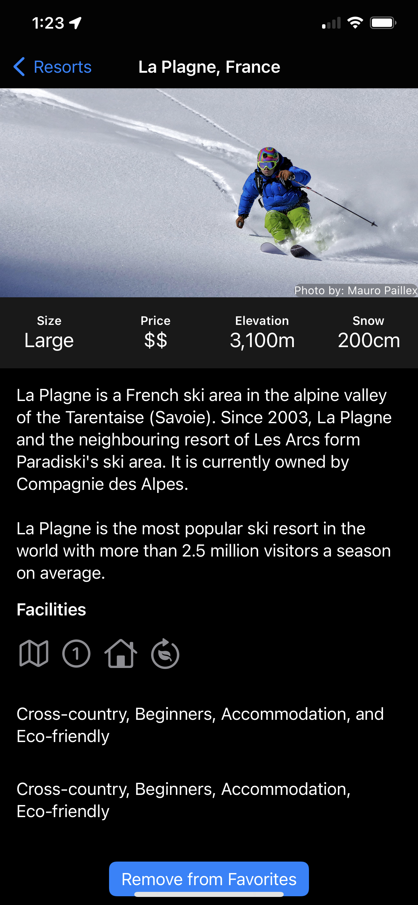

# SnowSeeker
Database work with ski resorts. Project 19 days 96,97,98,99 of 100 days of swiftUI.

This app was focused on using optionals in more creative way, more complex view structs, sorting data, and pulling that data in different ways to display information.

  

The solutions to the challenges are marked in this code, feel free to read and use the solutions, but remember to focus on learning!

It would be useful to extend this information to access live data such as schedules and availability of the slopes, phone numbers, making reservations etc.
